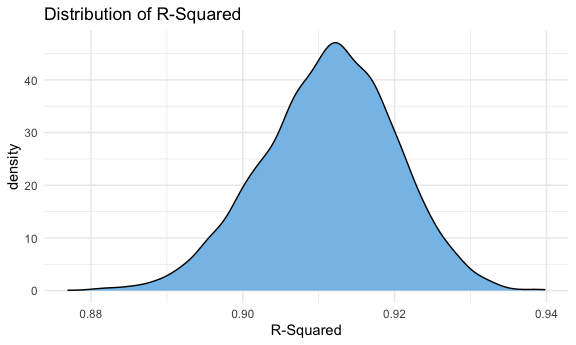

P8105\_HW6\_mc4959
================
Meiju Chen
12/9/2020

### Problem 1

##### Read and tidy the data.

``` r
homicide_df = 
  read_csv('./data/homicide_data.csv', na = c('', 'NA', 'Unknown')) %>%
  mutate(
    city_state = str_c(city, state, sep = ", "),
    victim_age = as.numeric(victim_age),
    result = case_when(
      disposition == "Closed without arrest" ~ 0,
      disposition == "Open/No arrest"        ~ 0,
      disposition == "Closed by arrest"      ~ 1)
  ) %>% 
  filter(
    victim_race %in% c('White', 'Black'),
    city_state != 'Tulsa, AL'
  ) %>% 
  select(city_state, result, victim_age, victim_race, victim_sex)
```

    ## Parsed with column specification:
    ## cols(
    ##   uid = col_character(),
    ##   reported_date = col_double(),
    ##   victim_last = col_character(),
    ##   victim_first = col_character(),
    ##   victim_race = col_character(),
    ##   victim_age = col_double(),
    ##   victim_sex = col_character(),
    ##   city = col_character(),
    ##   state = col_character(),
    ##   lat = col_double(),
    ##   lon = col_double(),
    ##   disposition = col_character()
    ## )

##### Baltimore, MD

Start with one city - Baltimore, MD.

``` r
baltimore_df = 
  homicide_df %>% 
  filter(city_state == 'Baltimore, MD')
glm(result ~ victim_age + victim_race + victim_sex,
    data = baltimore_df,
    family = binomial()
  ) %>% 
  broom::tidy() %>% 
  mutate(
    OR = exp(estimate),
    CI_lower = exp(estimate - 1.96 * std.error),
    CI_upper = exp(estimate + 1.96 * std.error)
  ) %>% 
  select(term, OR, starts_with("CI")) %>% 
  knitr::kable(digits = 3)
```

| term              |    OR | CI\_lower | CI\_upper |
| :---------------- | ----: | --------: | --------: |
| (Intercept)       | 1.363 |     0.975 |     1.907 |
| victim\_age       | 0.993 |     0.987 |     1.000 |
| victim\_raceWhite | 2.320 |     1.648 |     3.268 |
| victim\_sexMale   | 0.426 |     0.325 |     0.558 |

##### Model for each cities

Try this across cities in the dataset.

``` r
model_df = 
  homicide_df %>% 
  nest(data = -city_state) %>% 
  mutate(
    models = 
      map(.x = data, ~glm(result ~ victim_age + victim_race + victim_sex, data = .x, family = binomial())),
    report = map(models, broom::tidy)
    ) %>%
  select(city_state, report) %>% 
  unnest(report) %>% 
  mutate(
    OR = exp(estimate),
    CI_lower = exp(estimate - 1.96 * std.error),
    CI_upper = exp(estimate + 1.96 * std.error)
  ) %>% 
  select(city_state, term, OR, starts_with("CI"))
```

##### Plot

Create a plot that shows the estimated ORs and CIs for each city.

``` r
model_df %>% 
  filter(term == "victim_sexMale") %>% 
  mutate(city_state = fct_reorder(city_state, OR)) %>% 
  ggplot(aes(x = city_state, y = OR)) +
  geom_point() + 
  geom_errorbar(aes(ymin = CI_lower, ymax = CI_upper)) + 
  theme(axis.text.x = element_text(angle = 90, vjust = 0.5, hjust = 1))
```


-----

### Problem 2

##### Load and clean the data.

``` r
bw_df = 
  read_csv("./data/birthweight.csv") %>% 
  mutate(
    babysex = case_when(
      babysex == 1 ~ "Male",
      babysex == 2 ~ "Female"
    ),
    frace = case_when(
      frace == 1 ~ "White",
      frace == 2 ~ "Black",
      frace == 3 ~ "Asian",
      frace == 4 ~ "Puerto Rican",
      frace == 8 ~ "Other",
      frace == 9 ~ "Unknown"
    ),
    mrace = case_when(
      mrace == 1 ~ "White",
      mrace == 2 ~ "Black",
      mrace == 3 ~ "Asian",
      mrace == 4 ~ "Puerto Rican",
      mrace == 8 ~ "Other"
    ),
    malform = case_when(
      malform == 0 ~ "absent",
      malform == 1 ~ "present"
    ),
    babysex = as.factor(babysex),
    frace = as.factor(frace),
    mrace = as.factor(mrace),
    malform = as.factor(malform)
  ) %>% 
  drop_na()
```

    ## Parsed with column specification:
    ## cols(
    ##   .default = col_double()
    ## )

    ## See spec(...) for full column specifications.

The dataset contains 4342 rows and 20 columns, and there is no missing
data.

<br>

##### Regression Model

I use stepwise elimination to find good predictors by the p-value for
the following regression model. The model looks like this: `lm(bwt ~
babysex + bhead + blength + delwt + fincome + gaweeks + mheight + mrace
+ parity + ppwt + smoken, data = baby_df)`.

``` r
# stepwise elimination
stepwise_model = 
  lm(bwt ~ ., data = bw_df) %>% 
  step(., direction = "both") %>% 
  broom::tidy()
```

    ## Start:  AIC=48717.83
    ## bwt ~ babysex + bhead + blength + delwt + fincome + frace + gaweeks + 
    ##     malform + menarche + mheight + momage + mrace + parity + 
    ##     pnumlbw + pnumsga + ppbmi + ppwt + smoken + wtgain
    ## 
    ## 
    ## Step:  AIC=48717.83
    ## bwt ~ babysex + bhead + blength + delwt + fincome + frace + gaweeks + 
    ##     malform + menarche + mheight + momage + mrace + parity + 
    ##     pnumlbw + pnumsga + ppbmi + ppwt + smoken
    ## 
    ## 
    ## Step:  AIC=48717.83
    ## bwt ~ babysex + bhead + blength + delwt + fincome + frace + gaweeks + 
    ##     malform + menarche + mheight + momage + mrace + parity + 
    ##     pnumlbw + ppbmi + ppwt + smoken
    ## 
    ## 
    ## Step:  AIC=48717.83
    ## bwt ~ babysex + bhead + blength + delwt + fincome + frace + gaweeks + 
    ##     malform + menarche + mheight + momage + mrace + parity + 
    ##     ppbmi + ppwt + smoken
    ## 
    ##            Df Sum of Sq       RSS   AIC
    ## - frace     4    124365 320848704 48712
    ## - malform   1      1419 320725757 48716
    ## - ppbmi     1      6346 320730684 48716
    ## - momage    1     28661 320752999 48716
    ## - mheight   1     66886 320791224 48717
    ## - menarche  1    111679 320836018 48717
    ## - ppwt      1    131132 320855470 48718
    ## <none>                  320724338 48718
    ## - fincome   1    193454 320917792 48718
    ## - parity    1    413584 321137922 48721
    ## - mrace     3    868321 321592659 48724
    ## - babysex   1    853796 321578134 48727
    ## - gaweeks   1   4611823 325336161 48778
    ## - smoken    1   5076393 325800732 48784
    ## - delwt     1   8008891 328733230 48823
    ## - blength   1 102050296 422774634 49915
    ## - bhead     1 106535716 427260054 49961
    ## 
    ## Step:  AIC=48711.51
    ## bwt ~ babysex + bhead + blength + delwt + fincome + gaweeks + 
    ##     malform + menarche + mheight + momage + mrace + parity + 
    ##     ppbmi + ppwt + smoken
    ## 
    ##            Df Sum of Sq       RSS   AIC
    ## - malform   1      1447 320850151 48710
    ## - ppbmi     1      6975 320855679 48710
    ## - momage    1     28379 320877083 48710
    ## - mheight   1     69502 320918206 48710
    ## - menarche  1    115708 320964411 48711
    ## - ppwt      1    133961 320982665 48711
    ## <none>                  320848704 48712
    ## - fincome   1    194405 321043108 48712
    ## - parity    1    414687 321263390 48715
    ## + frace     4    124365 320724338 48718
    ## - babysex   1    852133 321700837 48721
    ## - gaweeks   1   4625208 325473911 48772
    ## - smoken    1   5036389 325885093 48777
    ## - delwt     1   8013099 328861802 48817
    ## - mrace     3  13540415 334389119 48885
    ## - blength   1 101995688 422844392 49908
    ## - bhead     1 106662962 427511666 49956
    ## 
    ## Step:  AIC=48709.53
    ## bwt ~ babysex + bhead + blength + delwt + fincome + gaweeks + 
    ##     menarche + mheight + momage + mrace + parity + ppbmi + ppwt + 
    ##     smoken
    ## 
    ##            Df Sum of Sq       RSS   AIC
    ## - ppbmi     1      6928 320857079 48708
    ## - momage    1     28660 320878811 48708
    ## - mheight   1     69320 320919470 48708
    ## - menarche  1    116027 320966177 48709
    ## - ppwt      1    133894 320984044 48709
    ## <none>                  320850151 48710
    ## - fincome   1    193784 321043934 48710
    ## + malform   1      1447 320848704 48712
    ## - parity    1    414482 321264633 48713
    ## + frace     4    124393 320725757 48716
    ## - babysex   1    851279 321701430 48719
    ## - gaweeks   1   4624003 325474154 48770
    ## - smoken    1   5035195 325885346 48775
    ## - delwt     1   8029079 328879230 48815
    ## - mrace     3  13553320 334403471 48883
    ## - blength   1 102009225 422859375 49906
    ## - bhead     1 106675331 427525481 49954
    ## 
    ## Step:  AIC=48707.63
    ## bwt ~ babysex + bhead + blength + delwt + fincome + gaweeks + 
    ##     menarche + mheight + momage + mrace + parity + ppwt + smoken
    ## 
    ##            Df Sum of Sq       RSS   AIC
    ## - momage    1     29211 320886290 48706
    ## - menarche  1    117635 320974714 48707
    ## <none>                  320857079 48708
    ## - fincome   1    195199 321052278 48708
    ## + ppbmi     1      6928 320850151 48710
    ## + malform   1      1400 320855679 48710
    ## - parity    1    412984 321270064 48711
    ## + frace     4    125020 320732060 48714
    ## - babysex   1    850020 321707099 48717
    ## - mheight   1   1078673 321935752 48720
    ## - ppwt      1   2934023 323791103 48745
    ## - gaweeks   1   4621504 325478583 48768
    ## - smoken    1   5039368 325896447 48773
    ## - delwt     1   8024939 328882018 48813
    ## - mrace     3  13551444 334408523 48881
    ## - blength   1 102018559 422875638 49904
    ## - bhead     1 106821342 427678421 49953
    ## 
    ## Step:  AIC=48706.02
    ## bwt ~ babysex + bhead + blength + delwt + fincome + gaweeks + 
    ##     menarche + mheight + mrace + parity + ppwt + smoken
    ## 
    ##            Df Sum of Sq       RSS   AIC
    ## - menarche  1    100121 320986412 48705
    ## <none>                  320886290 48706
    ## - fincome   1    240800 321127090 48707
    ## + momage    1     29211 320857079 48708
    ## + ppbmi     1      7479 320878811 48708
    ## + malform   1      1678 320884612 48708
    ## - parity    1    431433 321317724 48710
    ## + frace     4    124743 320761547 48712
    ## - babysex   1    841278 321727568 48715
    ## - mheight   1   1076739 321963029 48719
    ## - ppwt      1   2913653 323799943 48743
    ## - gaweeks   1   4676469 325562760 48767
    ## - smoken    1   5045104 325931394 48772
    ## - delwt     1   8000672 328886962 48811
    ## - mrace     3  14667730 335554021 48894
    ## - blength   1 101990556 422876847 49902
    ## - bhead     1 106864308 427750598 49952
    ## 
    ## Step:  AIC=48705.38
    ## bwt ~ babysex + bhead + blength + delwt + fincome + gaweeks + 
    ##     mheight + mrace + parity + ppwt + smoken
    ## 
    ##            Df Sum of Sq       RSS   AIC
    ## <none>                  320986412 48705
    ## + menarche  1    100121 320886290 48706
    ## - fincome   1    245637 321232048 48707
    ## + momage    1     11698 320974714 48707
    ## + ppbmi     1      8823 320977589 48707
    ## + malform   1      1884 320984528 48707
    ## - parity    1    422770 321409181 48709
    ## + frace     4    128726 320857686 48712
    ## - babysex   1    846134 321832545 48715
    ## - mheight   1   1012240 321998651 48717
    ## - ppwt      1   2907049 323893461 48743
    ## - gaweeks   1   4662501 325648912 48766
    ## - smoken    1   5073849 326060260 48771
    ## - delwt     1   8137459 329123871 48812
    ## - mrace     3  14683609 335670021 48894
    ## - blength   1 102191779 423178191 49903
    ## - bhead     1 106779754 427766166 49950

``` r
# regression model
r_model = 
  lm(bwt ~ babysex + bhead + blength + delwt + fincome + gaweeks + mheight + mrace + parity + ppwt + smoken, data = bw_df)

r_model %>% 
  broom::tidy() %>% 
  select(term, estimate, p.value) %>% 
  knitr::kable(digits = 3)
```

| term              |   estimate | p.value |
| :---------------- | ---------: | ------: |
| (Intercept)       | \-6145.151 |   0.000 |
| babysexMale       |   \-28.558 |   0.001 |
| bhead             |    130.777 |   0.000 |
| blength           |     74.947 |   0.000 |
| delwt             |      4.107 |   0.000 |
| fincome           |      0.318 |   0.069 |
| gaweeks           |     11.592 |   0.000 |
| mheight           |      6.594 |   0.000 |
| mraceBlack        |   \-63.906 |   0.132 |
| mracePuerto Rican |   \-25.791 |   0.570 |
| mraceWhite        |     74.887 |   0.077 |
| parity            |     96.305 |   0.017 |
| ppwt              |    \-2.676 |   0.000 |
| smoken            |    \-4.843 |   0.000 |

<br>

##### Residual Plot

``` r
bw_df %>% 
  add_residuals(r_model) %>% 
  add_predictions(r_model) %>% 
  ggplot(aes(x = pred, y = resid)) +
  geom_point(color = '#85C1E9', alpha = 0.4) +
  labs(
    title = 'Residual vs. fitted values for the stepwise eliminated model',
    x = 'Predictions',
    y = 'Residuals'
  )
```


<br>

##### Two other models

``` r
model_1 = lm(bwt ~ blength + gaweeks, data = bw_df)
model_2 = lm(bwt ~ bhead * blength * babysex, data = bw_df)

model_1 %>% 
  broom::tidy() %>% 
  select(term, estimate, p.value) %>% 
  knitr::kable(digits = 3)
```

| term        |   estimate | p.value |
| :---------- | ---------: | ------: |
| (Intercept) | \-4347.667 |       0 |
| blength     |    128.556 |       0 |
| gaweeks     |     27.047 |       0 |

``` r
model_2 %>% 
  broom::tidy() %>% 
  select(term, estimate, p.value) %>% 
  knitr::kable(digits = 3)
```

| term                      |   estimate | p.value |
| :------------------------ | ---------: | ------: |
| (Intercept)               |  \-801.949 |   0.467 |
| bhead                     |   \-16.598 |   0.626 |
| blength                   |   \-21.646 |   0.354 |
| babysexMale               | \-6374.868 |   0.000 |
| bhead:blength             |      3.324 |   0.000 |
| bhead:babysexMale         |    198.393 |   0.000 |
| blength:babysexMale       |    123.773 |   0.000 |
| bhead:blength:babysexMale |    \-3.878 |   0.000 |

<br>

##### Cross Validation & Violin Plot of RMSEs

``` r
# cross validation
cv_df =
  crossv_mc(bw_df, 200)

cv_df = 
  cv_df %>% 
  mutate(
    train = map(train, as_tibble),
    test = map(test, as_tibble)
  )

# fit the models and get violin plot of RMSEs
cv_df = 
  cv_df %>% 
  mutate(
    fit_select = map(
      .x = train, ~lm(bwt ~ babysex + bhead + blength + delwt + fincome + gaweeks + mheight + mrace + parity + ppwt + smoken, data = .x)),
    fit_1 = map(
      .x = train, ~lm(bwt ~ blength + gaweeks, data = .x)),
    fit_2 = map(
      .x = train, ~lm(bwt ~ bhead * blength * babysex, data = .x)
    )
  ) %>% 
  mutate(
    rmse_fit_select = map2_dbl(.x = fit_select, .y = test, ~rmse(model = .x, data = .y)),
    rmse_fit_1 = map2_dbl(.x = fit_1, .y = test, ~rmse(model = .x, data = .y)),
    rmse_fit_2 = map2_dbl(.x = fit_2, .y = test, ~rmse(model = .x, data = .y))
  )

cv_df %>% 
  select(starts_with("rmse")) %>% 
  pivot_longer(
    everything(),
    names_to = "model",
    values_to = "rmse",
    names_prefix = "rmse_"
  ) %>% 
  ggplot(aes(x = model, y = rmse)) +
  geom_violin() +
  labs(
    title = "Cross Validation Violin Plot",
    x = "Models",
    y = "RMSE"
  )
```


Above is the cross validation violin plots for three models:

  - The `fit_select` model is created from stepwise elimination.

  - The `fit_2` model includes the interactions between head
    circumference, length, and sex.

  - The `fit_1` model uses birth length, gestational age as predictors.

From the plot, we can see that the `fit_select` model has the lowest
squared root of residuals variance so the predicted values are the
closest to the observed values. In addition, the `fit_1` model has the
highest RMSE value, while the `fit_2` model has the second to the lowest
RMSE value.

-----

### Problem 3

##### Load and clean the data.

``` r
weather_df = 
  rnoaa::meteo_pull_monitors(
    c("USW00094728"),
    var = c("PRCP", "TMIN", "TMAX"), 
    date_min = "2017-01-01",
    date_max = "2017-12-31") %>%
  mutate(
    name = recode(id, USW00094728 = "CentralPark_NY"),
    tmin = tmin / 10,
    tmax = tmax / 10) %>%
  select(name, id, everything())
```

    ## Registered S3 method overwritten by 'hoardr':
    ##   method           from
    ##   print.cache_info httr

    ## using cached file: /Users/angelinechen/Library/Caches/R/noaa_ghcnd/USW00094728.dly

    ## date created (size, mb): 2020-12-09 12:11:37 (7.536)

    ## file min/max dates: 1869-01-01 / 2020-12-31

<br>

##### Bootstraps

``` r
set.seed(1234)

boot_samp = function(df) {
  sample_frac(df, replace = TRUE)
}
```

``` r
boot_df = 
  data_frame(
    strap_number = 1:5000,
    strap_sample = rerun(5000, boot_samp(weather_df))
  )

boot_results = 
  boot_df %>% 
  mutate(
    models = map(.x = strap_sample, ~lm(tmax ~ tmin, data = .x)), 
    results = map(models, broom::glance)
  ) %>%
  select(strap_number, results) %>% 
  unnest(results)
```

<br>

##### Distribution of R-Squared (r̂^ 2)

``` r
rsqu_p = 
  boot_results %>%
  ggplot(aes(x = adj.r.squared)) +
  geom_density(fill = '#85C1E9', aplpha = 0.6) +
  labs(
      title = "Distribution of R-Squared",
      x = "R-Squared"
    )

rsqu_p
```



From the plot above, it seems that the distribution of R-squared follows
normal distribution, centered around 0.91. Thus, we can say that the
model is a good estimate of the response variable.

The 95% CI for the adjusted R-squared is (0.8933721, 0.9274341).

<br>

##### Log (β̂ 0∗β̂ 1)

``` r
boot_2_df = 
  weather_df %>% 
  bootstrap(5000, id = "strap_number") %>% 
  mutate(
    models = map(.x = strap, ~lm(tmax ~ tmin, data = .x)), 
    results = map(models, broom::tidy)
  ) %>% 
  select(strap_number, results) %>% 
  unnest(results) %>% 
  select(term, estimate) %>%
  pivot_wider(
    names_from = term,
    values_from = estimate
  ) %>% 
  unnest(cols = c(`(Intercept)`, tmin)) %>%
  rename(
    beta_0 = '(Intercept)',
    beta_1 = tmin
  ) %>% 
 mutate(
    log_fx = log(beta_0*beta_1)
  )
```

``` r
log_p = 
  boot_2_df %>%
  ggplot(aes(x = log_fx)) +
  geom_density(fill = '#F7DC6F', alpha = 0.6) +
  labs(
      title = 'Distribution of Log Function',
      x = 'Log (beta_0 * beta_1)'
    )

log_p
```


From the plot above, we can see that the estimated log function (beta\_0
\* beta\_1) plot also follows normal distribution, centered around
2.025.

The 95% CI for log (beta\_0 \* beta\_1) is (1.965647, 2.0595859).
